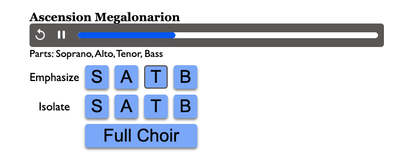
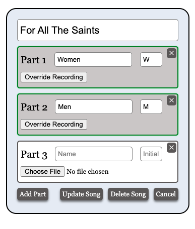

# Choral Tracks: React

Choral Tracks is a React app for playing individual parts, or tracks, of choral pieces. You can check out [the website here](https://htaoc.com/choir/) to see it in the wild. However, if you want to investigate the Admin section with the upload/edit functionality (i.e., the coolest part), you'll need to install it locally, along with the Rails backend `choral-tracks-rails`

## Public Features

I made Choral Tracks to help my church choir learn their parts on their own.  The app features song players that allows the user to toggle between:

1. An individual part
2. All the parts together
3. All the parts, but with one part louder than the others

All the parts are synced using the JavaScript Audio API and correspond to a single progress bar. Unfortunately, the perfect synchronization comes with a performance cost, since each track has to be downloaded in its entirety for Audio API to work (basically, no streaming).
<br>
<br>



## Admin Features

Editing and creating new songs is done in the Admin section. When creating a new song, the admin can specify as many parts as they need. The backend records how many parts were promised originally. If the upload fails for some reason during the submission and one or more tracks are therefore missing, the admin can edit the song with the form prepopulated with the fulfilled parts. The song will only be available to the public if the number of uploaded parts matches the number of parts that the form promised originally (unless the admin then resubmits the form with those unfulfilled parts deleted).
<br>
<br>


## Installation

* First, follow the instructions to install and set up the Rails backend (https://github.com/mathpianop/choral-tracks-rails).

* Next, clone this repository and install the Node dependencies:
```bash
git clone git@github.com:mathpianop/choral-tracks-react.git
cd choral-tracks-react
yarn install
```
<br>
<br>

* Next, run the script to switch details from production to development:
```bash
  yarn run develop
```
<br>
<br>

* Finally, start the react server:
```bash
  yarn start
```


## Using the app locally

If you seeded the database in the Rails backend, you should be able to see two sample songs on the page. You can also access the Admin section using the username "sample", and and the password "password". You can interact with the create/edit song form, but you won't be able to create or destroy songs without setting up your own Cloudinary account and info in an .env file.

## License

Choral Tracks is released under the [MIT License](https://opensource.org/licenses/MIT)